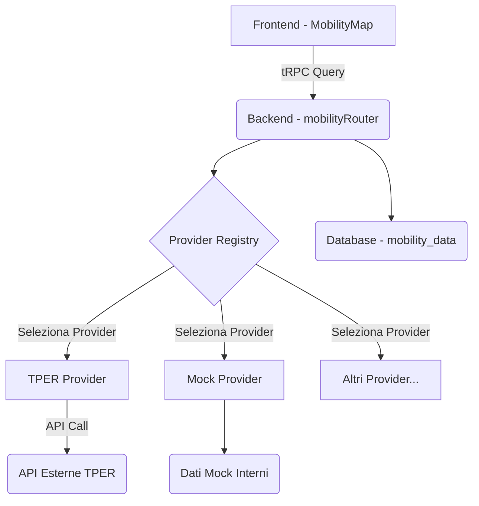

# Architettura Centro Mobilità Scalabile

**Version:** 1.0  
**Date:** 22 November 2024  
**Author:** Manus AI Agent

---

## 1. Obiettivi

L'architettura del Centro Mobilità è progettata per essere **scalabile, flessibile e manutenibile**, con i seguenti obiettivi:

- **Supporto Multi-Provider**: Gestire diversi fornitori di dati di trasporto pubblico (TPER Bologna, ATM Milano, ATAC Roma, etc.) per mercati diversi.
- **Dati Real-Time (con cache)**: Fornire dati aggiornati senza sovraccaricare le API esterne.
- **Integrazione Semplice**: Facilitare l'aggiunta di nuovi provider senza modificare il codice core.
- **Separazione delle Responsabilità**: Mantenere una chiara divisione tra logica di business, accesso ai dati e presentazione.

---

## 2. Architettura Logica

L'architettura si basa su un **pattern a provider**, dove ogni provider è responsabile di recuperare e normalizzare i dati da una fonte esterna.



### Componenti

| Componente | Descrizione |
| :--- | :--- |
| **Frontend (MobilityMap)** | Componente React che visualizza i dati di mobilità su una mappa (Google Maps). Interroga il backend tramite tRPC. |
| **Backend (mobilityRouter)** | Router tRPC che espone le API per il Centro Mobilità. Gestisce le richieste, seleziona il provider corretto e interagisce con il database. |
| **Provider Registry** | Un registro che mappa i nomi dei provider (es. `tper`, `mock`) alle loro implementazioni. |
| **Mobility Provider** | Un'interfaccia che definisce i metodi che ogni provider deve implementare (`fetchStops`, `fetchLines`). |
| **TPER Provider** | Implementazione specifica per le API TPER di Bologna. Recupera dati da `solweb.tper.it`. |
| **Mock Provider** | Implementazione per il testing, restituisce dati di esempio senza chiamate esterne. |
| **Database (mobility_data)** | Tabella PostgreSQL che memorizza i dati di mobilità normalizzati, fungendo da cache e fonte dati per il frontend. |

---

## 3. Flusso Dati

### Sincronizzazione Dati (Periodica)

1. Un processo schedulato (o un'azione manuale) chiama l'endpoint `mobility.syncFromProvider`.
2. Il `mobilityRouter` riceve la richiesta, specificando il `marketId` e il `providerName`.
3. Il router seleziona il provider corretto dal registro (es. `tperProvider`).
4. Il `tperProvider` effettua chiamate API alle fonti esterne TPER (es. `stops`, `arrivals`).
5. I dati grezzi vengono normalizzati nel formato `MobilityStop`.
6. Il `mobilityRouter` cancella i vecchi dati per quel `marketId` dalla tabella `mobility_data`.
7. I nuovi dati normalizzati vengono inseriti nella tabella `mobility_data`.
8. L'operazione viene registrata nella tabella `audit_logs`.

### Visualizzazione Dati (Real-Time)

1. Il componente `MobilityMap` nel frontend chiama l'endpoint `mobility.list` con il `marketId` desiderato.
2. Il `mobilityRouter` esegue una query sulla tabella `mobility_data` per recuperare i dati memorizzati.
3. I dati vengono restituiti al frontend.
4. Il `MobilityMap` renderizza i dati sulla mappa, mostrando icone per fermate e parcheggi, e popup con dettagli.

### Aggiornamenti Real-Time (Opzionale)

Per aggiornamenti più frequenti (es. arrivi in tempo reale), il frontend può chiamare un endpoint dedicato (`mobility.getUpdates`) che a sua volta interroga il provider per dati freschi su fermate specifiche, senza ricaricare tutti i dati.

---

## 4. Schema Database

La tabella `mobility_data` è il cuore del sistema e memorizza i dati normalizzati da tutti i provider.

```sql
CREATE TABLE mobility_data (
  id SERIAL PRIMARY KEY,
  market_id INTEGER REFERENCES markets(id), -- Link al mercato
  type VARCHAR(50) NOT NULL, -- bus, tram, parking
  line_number VARCHAR(20),
  line_name VARCHAR(255),
  stop_name VARCHAR(255),
  lat VARCHAR(20),
  lng VARCHAR(20),
  status VARCHAR(50) DEFAULT 'active', -- active, delayed, suspended
  occupancy INTEGER, -- 0-100%
  available_spots INTEGER, -- Per parcheggi
  total_spots INTEGER, -- Per parcheggi
  next_arrival INTEGER, -- Minuti
  updated_at TIMESTAMP DEFAULT NOW() NOT NULL,
  created_at TIMESTAMP DEFAULT NOW() NOT NULL
);
```

---

## 5. API Backend (tRPC)

Il `mobilityRouter` espone le seguenti API:

- **`list` (Query)**: Lista i dati di mobilità, con filtri opzionali per `marketId` e `type`.
- **`getById` (Query)**: Recupera un singolo dato di mobilità per ID.
- **`create` (Mutation)**: Crea un nuovo dato di mobilità (per gestione manuale).
- **`update` (Mutation)**: Aggiorna un dato di mobilità esistente.
- **`delete` (Mutation)**: Elimina un dato di mobilità.
- **`syncFromProvider` (Mutation)**: Sincronizza i dati da un provider esterno.
- **`getProviders` (Query)**: Restituisce la lista dei provider disponibili.

---

## 6. Vantaggi di questa Architettura

- **Scalabilità**: Aggiungere un nuovo provider (es. ATM Milano) richiede solo di creare un nuovo file `atmProvider.ts` e registrarlo nel `providerRegistry`.
- **Manutenibilità**: La logica di ogni provider è isolata, rendendo più semplice la gestione di modifiche alle API esterne.
- **Performance**: Il frontend interroga sempre il database locale, che è veloce. La sincronizzazione con le API esterne avviene in background.
- **Flessibilità**: Ogni mercato può essere configurato per usare un provider diverso, permettendo una copertura nazionale graduale.
- **Resilienza**: Se un'API esterna è offline, il sistema può continuare a funzionare con i dati in cache, cache (seppur non aggiornati).
